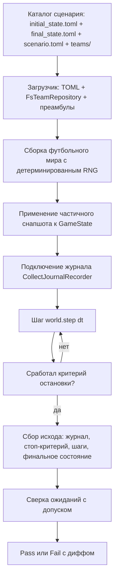

# Задача

Задача: иметь возможность интеграционного тестирования всей цепочки ядро - стандартная библиотека - скрипты игрока и точки зрения корректного выполнения игровой логики и защита от регресса. В качестве тестов должны выступать гранулярные сценарии.

У нас уже есть проект ynwa-script-tests, однако его проблема в том, что он не позволяет прогонять тесты автоматически: чтобы проконтролировать правильное исполнение скрипта, пользователь должен глазами через UI отследить ситуацию при воспроизведении сценария.

Разделение ответственности с task_4 (зафиксировано):

- автоматическое тестирование сценариев (частичный снапшот, прогон, сверка ожиданий) — эта задача (task_8);
- визуальный контроль сценария через плеер (полноценный снапшот в записи + чтение его перед воспроизведением) — task_4.

Требования к новой системе тестов:

Начальный снапшот. Разработчик задаёт начальное состояние игры, достаточное для провоцирования нужной ситуации. Снапшот частичный: перечисляются только задаваемые поля, остальное заполняется детерминированными значениями по умолчанию; недостающие поля добавляются по мере необходимости. Полная сериализация GameState — отдельная задача (task_4), формат снапшота должен быть с ней совместим. Состав команд, характеристики, регионы и тактика задаются существующими механизмами (teams/, static.toml, tactical.toml, preamble.lua, script.lua). Помимо тактик снапшот может задавать:
- позицию и скорость мяча;
- точные позиции игроков в метрах (переопределяют начальные позиции из тактик; тактические регионы, set-piece-ключи и роли при этом не меняются; нужны сценариям стандартной библиотеки для проверки граничных дистанций);
- стартовую стадию (Play / Setup(reason) / GameOver);
- для Setup — restart_position и restart_team;
- начальное владение: possessed_by и last_possessing_team.

План прогона: длина шага (dt), длительность/число шагов и критерии остановки. Критерии остановки — типизированный список, прогон останавливается любым из них: смена стадии на заданную целевую стадию, наступление события, таймаут/лимит шагов (обязательный страховочный критерий против зацикливания). Набор критериев расширяется по мере необходимости.

Ожидания от симуляции (каждый пункт опционален):
- точный упорядоченный список событий из журнала: принятые решения, действия игроков, общие события движка и специально игровые события (Goal/Touchline/GoalLine/GameEnd). Сравниваются типы и порядок событий; таймстемпы и float-поля сравниваются нормализованно либо с допуском;
- критерий, по которому завершился прогон, и число шагов;
- итоговое состояние: стадия, позиции игроков, позиция и владение мячом, счёт, restart_position/restart_team.

Симуляция ведётся с записью игры через существующий механизм журнала (context/docs/context_serialization.md).

Режимы запуска:
- автоматический обсчёт всех сценариев — не требует реального времени, основной режим, встроен в общий прогон тестов; реализуется в этой задаче;
- прогон сценария в реальном времени через плеер для визуального контроля — реализуется в task_4 через полноценный снапшот в записи и его применение перед воспроизведением (record → replay).

Примеры тестовых сценариев для ядра:
- мяч в воротах в игровой стадии - определён гол. Начальное положение: игрок перед воротами, его задание - ударить по воротам. проверяем: гол зафиксирован, стадия игры изменилась. Проверяем для пар: игроки команда А/Б, голы в чужие/свои ворота.
- после выхода мяча за боковую игроки расставились по стандартным позициям. Здесь много вариантов: выход за лицевую линию (свою и чужую) слева и справа от ворот, выход за боковую линию (слева и справа) от своего и чужого игрока. Проверяется: стадия игры изменилась, игроки расставились по своим позициям.

Примеры тестовых сценариев для стандартной библиотеки:
- мы добавили функцию, определяющую игровую ситуацию. Например, "игрок моей команды с таким-то номером свободен от опеки, рядом с ним никого нет". Тесты моделируют множество ситуаций и проверяют работу этой функции.
- мы добавили функцию, генерирующую решение. Например "если ситуация такая, стой на месте, иначе беги в такую-то точку". Тесты моделируют множество ситуаций и проверяют работу этой функции.

Для проверки ситуаций с граничными дистанциями (например, «свободен от опеки») сценариям требуются точные позиции игроков в метрах, а не только регионы из тактик.

Есть много элементов футбола, которые мы пока не поддерживаем: офсайд, нарушение правил, штрафной удар и проч. Когда они будут поддерживаться, они также потребуют тестирования.

---

# Архитектурное решение

## 1. Общая схема

Создаётся новый крейт **`ynwa-integration-testing`** — библиотека модели сценария, загрузчика и
раннера. В этой задаче крейт покрывает **только автоматический режим**: интеграционные тесты
обходят каталог `scenarios/` и прогоняют каждый сценарий в рамках `cargo test`.

Визуальный контроль (реальное время) в эту задачу не входит: он обеспечивается в task_4 (полный
снапшот в записи + применение его перед воспроизведением) через существующий режим `--replay` в
`ynwa-player`. Связь `ynwa-player` ↔ `ynwa-integration-testing` не создаётся: плеер продолжает
читать только записи (`Record`). Сценарии он не читает; снапшоты попадают в плеер в составе записи
(task_4), а не отдельным файлом.

`ynwa-script-tests` остаётся как есть и будет удалён позднее, когда его возможности перекроются
новыми механизмами.

Зависимости крейта: `ynwa-core`, `ynwa-football`, `ynwa-repository`, `serde`, `serde_json`,
`toml`, `uom`.



## 2. Структура каталога сценария

```
ynwa-integration-testing/scenarios/<имя>/
  initial_state.toml          # частичное начальное состояние (вход)
  final_state.toml       # ожидаемое конечное состояние — частичный GameState (выход)
  scenario.toml          # план прогона [run] + ожидания [expect] (стоп, журнал)
  teams/
    team_a/
      preamble.lua
      players/NN/{static.toml, tactical.toml, script.lua}
    team_b/
      ...
```

`teams/` читается существующим `FsTeamRepository` (формат `protocols.md` §2–3), преамбулы ядра и
стандартной библиотеки — из `ynwa-scripts/preambles` (как в `create_football_world`). Состав
команд, характеристики, регионы и тактика задаются существующими механизмами, без дублирования.

Начальное и ожидаемое конечное состояние — это один и тот же формат частичного `GameState`, поэтому
оба вынесены в отдельные файлы: `initial_state.toml` (вход) и `final_state.toml` (выход). Различие только
в семантике («отсутствующее поле = не задавать» у входа и «= не проверять» у выхода) и в том, что
`final_state.toml` дополнительно несёт счёт.

## 3. Формат файлов сценария

### 3.1 `initial_state.toml` — частичное начальное состояние

Задаются только перечисленные поля; отсутствующие заполняются детерминированными значениями по
умолчанию (см. §4). Кодировки значений совместимы с будущей сериализацией `GameState` (task_4):
`Point3D` как `{x,y,z}` в метрах, `Velocity3D` в м/с, `Team` как `"A"`/`"B"` (см. §7).

```toml
stage = "Play"            # "Play" | "Setup" | "GameOver"
setup_reason = "kick off" # только при stage = "Setup"; по умолчанию "kick off"

[ball]
position = { x = 34.0, y = 0.0, z = 10.0 }   # необязательно
velocity = { x = 0.0, y = 0.0, z = 0.0 }     # необязательно
possessed_by = { team = "A", number = 9 }    # необязательно; "none" — мяч свободен
last_possessing_team = "A"                   # необязательно

[setup]                   # имеет смысл только при stage = "Setup"
restart_position = { x = 34.0, y = 0.0, z = 5.5 }  # необязательно
restart_team = "A"                                  # необязательно

[[players]]               # необязательный список: точные позиции в метрах
team = "A"
number = 9
position = { x = 34.0, y = 0.0, z = 10.0 }
```

Поля снапшота:

- `stage` + `setup_reason` — стартовая стадия; при отсутствии остаётся стадия, созданная фабрикой
  мира (`Setup("kick off")`).
- случайность не настраивается: раннер жёстко использует детерминированный RNG (`temperature = 0.0`,
  фиксированный `seed`) — полностью воспроизводимый прогон, база для защиты от регресса.
- `ball.position` / `ball.velocity` — позиция и скорость мяча; по умолчанию `ball.initial_position`
  и нулевая скорость.
- `ball.possessed_by` — ссылка на игрока `{team, number}`; `"none"` — свободен; отсутствует — не
  задавать (остаётся `None`).
- `ball.last_possessing_team` — команда последнего владения.
- `setup.restart_position` / `setup.restart_team` — для стадии `Setup`.
- `players` — точные позиции игроков в метрах. **Переопределяют только начальную позицию**
  (`PlayerState.position`); тактические регионы, `set_piece_positions` и роли исполнителя из
  `tactical.toml` остаются нетронутыми и по-прежнему видны скриптам (`my_regions()` и т.д.).
  Игроки, не указанные в списке, получают фабричную позицию (центр региона `start` в `Play`, точка
  за полем в `Setup`). Идентификация по `{team, number}` (номер — `tactical.toml.number`).

### 3.2 `scenario.toml` — план прогона `[run]`

```toml
[run]
dt = 0.1                # длина шага, обязательна

[[run.stop]]            # типизированный список; прогон останавливается ЛЮБЫМ критерием
when = "stage"          # смена стадии на целевую
stage = "Setup"         # "Play" | "Setup" | "GameOver"; Setup + setup_reason

[[run.stop]]
when = "event"          # наступление события
event = "Goal"          # Goal | Touchline | GoalLine | GameEnd
team = "B"              # необязательно: уточнение события (здесь — гол в ворота команды B)

[[run.stop]]
when = "steps"          # лимит шагов — обязательный страховочный критерий
steps = 10000

# [[run.stop]]
# when = "time"         # лимит модельного времени — страховочный критерий
# time = 60.0
```

Типы критериев (`StopCriterion`):

- `OnStage(GameStage)` — стадия стала равна целевой;
- `OnEvent(EventMatcher)` — в журнале появилось заданное футбольное событие; сравнение по типу
  события, опционально по дополнительным полям (например, `team` у `Goal`);
- `OnSteps(u64)` — достигнут лимит шагов;
- `OnTime(f32)` — достигнуто модельное время.

Загрузчик требует хотя бы один страховочный критерий `steps` или `time` (иначе ошибка загрузки) —
защита от зацикливания.

### 3.3 `scenario.toml` — ожидания `[expect]` (каждый пункт опционален)

```toml
[expect.stop]           # каким критерием завершился прогон и число шагов
when = "event"
event = "Goal"
team = "B"
steps = 15              # необязательно: точное число шагов

[[expect.journal]]      # точный упорядоченный список событий журнала
type = "football_event"
event = "Goal"
team = "B"

[[expect.journal]]
type = "stage_change"
stage = "Setup"
at = 1.5                # необязательно: ожидаемый timestamp (с допуском)
```

Ожидаемое конечное состояние задаётся отдельным файлом `final_state.toml` (см. §3.4), а не в составе
`scenario.toml`.

Типы записей журнала (`ExpectedEvent`), по одной на строку `[[expect.journal]]`, с
полем-дискриминатором `type`:

- `decision_assigned` — опц. `player`, `decision`, `reason`;
- `possession_change` — опц. `possessed_by`, `last_possessing_team`;
- `kick_outcome` — опц. `player`, `ball_velocity`;
- `stage_change` — опц. `stage`;
- `restart_set` — опц. `position`, `team`;
- `decisions_reset`;
- `stat_update` — опц. `team`, `key`, `delta`;
- `football_event` — опц. `event` (`Goal` / `Touchline` / `GoalLine` / `GameEnd` и полезная нагрузка).

Сравнение журнала (§5.2): сверяются типы и порядок; `timestamp` и float-поля — с допуском;
неуказанные поля не проверяются.

### 3.4 `final_state.toml` — ожидаемое конечное состояние

Тот же формат частичного состояния, что и у `initial_state.toml`, но с семантикой «**отсутствующее поле
= не проверять**»; присутствующее поле сравнивается (координаты — с допуском). Дополнительно задаётся
счёт. Файл опционален: если его нет, конечное состояние не проверяется.

```toml
stage = "Setup"            # необязательно
score = { A = 1, B = 0 }   # необязательно: счёт по командам

[ball]                     # необязательно
position = { x = 34.0, y = 0.0, z = 10.0 }
possessed_by = "none"
last_possessing_team = "A"

[setup]                    # необязательно
restart_position = { x = 34.0, y = 0.0, z = 5.5 }
restart_team = "B"

[[players]]                # необязательно
team = "A"
number = 9
position = { x = 34.0, y = 0.0, z = 10.0 }
```

## 4. Семантика снапшота и применение к миру

Порядок сборки раннером:

1. Сборка мира билдером `FootballWorldBuilder::new(repo, preambles_path).with_rng(rng).build()`,
   где RNG детерминирован и захардкожен в раннере: `temperature = 0.0` и фиксированный `seed`
   (константа в `ynwa-integration-testing`).
2. Поверх собранного мира применяется снапшот (поля `GameState` публичны):
   - `stage` → `state.stage`; для `Setup` дополнительно `restart_position` / `restart_team` из
     `[setup]`;
   - мяч → `state.ball_state.{position, velocity, possessed_by, last_possessing_team}`;
     `possessed_by` резолвится из `{team, number}` в глобальный индекс;
   - `players` → `state.player_states[i].position` по резолву `{team, number}` → индекс.

Идентификация игрока `{team, number}`: поиск в `config.players` по `team` и `number` (номер из
`tactical.toml`); дубликаты или отсутствие — ошибка загрузки сценария.

Замечания:

- снапшот задаёт только позиции игроков; скорости игроков остаются нулевыми (дефолт
  `Game::with_stage`);
- `elapsed_time` снапшотом не задаётся (прогон всегда стартует с нулевого модельного времени);
- таймеры реакции (`last_decision_time`) и антидребезга (`last_possession_change_time`) снапшотом
  не задаются (расширяется по мере необходимости).

## 5. Раннер

### 5.1 Прогон

```
собрать мир (детерминированный rng, захардкожен в раннере)
применить снапшот
подключить CollectJournalRecorder
steps = 0
пока не сработал критерий:
    world.step(dt)
    steps += 1
    проверить критерии в порядке объявления; первый сработавший фиксируется
исход = { журнал JournalEntry[], декодированные football-события, stop_reason, steps, GameState }
```

Критерии проверяются после шага: `OnStage` — по `state.stage`; `OnEvent` — по журналу
(инкрементально декодируются `football_event`); `OnSteps` / `OnTime` — по счётчику / `elapsed_time`.
Первый сработавший критерий попадает в `StopReason`.

### 5.2 Сверка ожиданий

- **Журнал.** Если задан `[[expect.journal]]`, фактический журнал должен совпасть с ожидаемым
  списком точно (та же длина и порядок). Каждая запись сравнивается по типу; указанные поля
  проверяются:
  - целые / перечисления / строки — точное равенство;
  - float-поля (`Point3D`, `Velocity3D`, `delta`, `timestamp`) — с допуском `TOLERANCE` (константа,
    например `1e-4` для метров и м/с; `timestamp` — с допуском `max(dt, 1e-4)`);
  - `at` в записи — ожидаемый абсолютный `timestamp` (нормализован к старту прогона).
- **Стоп.** `[expect.stop]` — сверка `StopReason` (тип и параметры критерия) и, при указании
  `steps`, точного числа шагов.
- **Финальное состояние.** Если задан `final_state.toml` — сверка указанных полей `GameState` с
  допуском для координат; реализуется тем же типом частичного состояния, что и снапшот.

При расхождении раннер возвращает структурированную ошибку с позицией и ожидаемым/фактическим
значениями (для читаемого вывода в `cargo test`).

## 6. Изменения в существующих крейтах

- **`ynwa-core`**: добавить тип частичного состояния `Snapshot` (serde, поля — `Option`; отсутствующее
  поле = «не трогать»; игроки адресуются глобальным индексом, как в `GameState`) и метод применения
  к `Game` (например, `Game::apply_snapshot`). Используется и `initial_state.toml`, и `final_state.toml`
  (у `final_state` та же форма, но «отсутствующее поле = не проверять»). Полный снапшот task_4 — это
  сериализованный `GameState` целиком (`Game::from_state`); частичный `Snapshot` task_8 разделяет с ним
  кодировки значений.
- **`ynwa-football`**: ввести билдер мира `FootballWorldBuilder::new(repo, preambles_path)` с методами
  `with_rng(...)` (и в task_4 — `with_snapshot`, `with_physics_last_update`) и `build()`. Существующий
  `create_football_world` становится обёрткой над билдером с дефолтами (температура `0.7`).

## 7. Совместимость с task_4

Частичный `Snapshot` task_8 (Option-поля) использует те же кодировки значений, что и полный снапшот
task_4 (полная сериализация `GameState`): `Point3D` / `Velocity3D` — числа в базовых единицах,
`Team` — строковое представление. Строковое представление `GameStage` (`stage` + `setup_reason`)
фиксируется здесь и переиспользуется task_4. task_4 добавляет: полную сериализацию `GameState`,
курсор журнала и состояние RNG в снапшоте, `Game::from_state`, запись снапшотов в `Record` и
воспроизведение с снапшота (`create_football_replay_world(record, seek_to)`) — это же даёт визуальный
контроль сценариев (record → replay).

